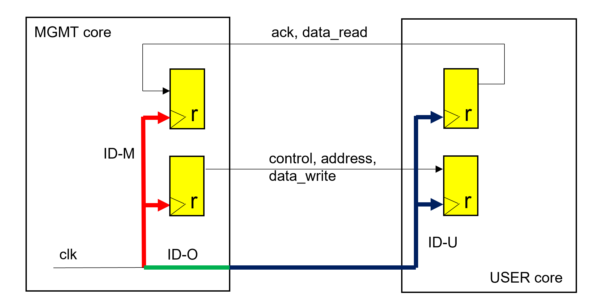
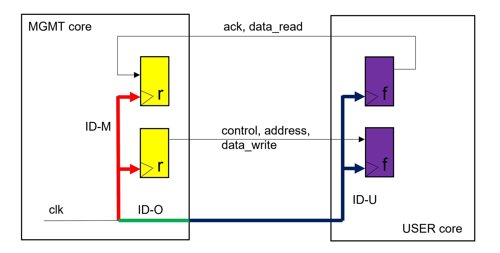
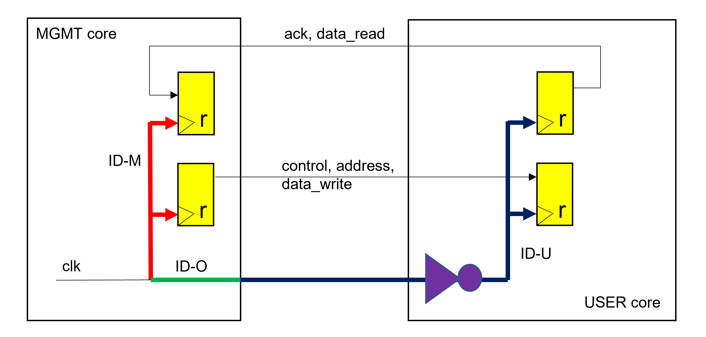
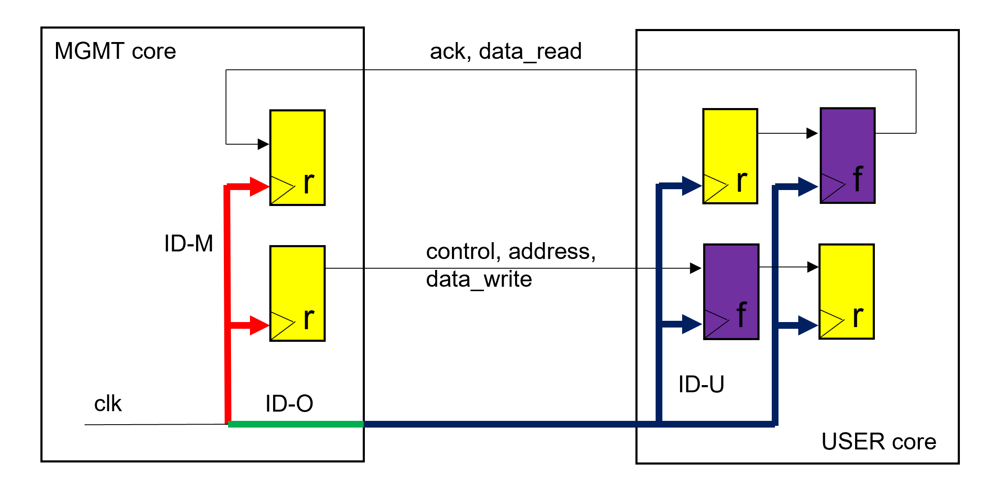

# Application Note WBHT: Handling Caravel Wishbone and Logic Analyzer Interface Hold Time Challenge

15th September 2022, revisited 30th December 2022 

Tobias Strauch, Munich, tobias at cloudx dot cc

## Introduction

The Caravel flow is unique in the sense, that a fixed macro (the management core) is used. The timing of the interface signals is relative to the Wishbone interface clock, which is an output of the macro. This creates a certain challenge to the Wishbone (WB) and logic analyzer (LA) interfaces. It requires the insertion of massive delay chains to reliably fix hold time violations in medium to large projects. 

A simple standard method to solve the problem is proposed, which is based on the usage of oppositely clocked registers. 

The app note is only relevant for designs which are driven by the WB clock.

## Definitions
 

Figure 1: Common Wishbone and logic analyzer interface handling. Signal names are kept abstract for better readability. 

The following definitions are used:

1) Insertion Delay (ID): Delay from clock root to a register clock input.
2) ID-M: Insertion delay inside the MGMT core. 
3) ID-O: Insertion delay, from clock root to MGMT core output
4) ID-U: Insertion delay inside the USER core (use_project_wrapper). 

The delays ID-M and ID-O are fixed. ID-U depends on the register load of the wb_clk_i clock domain. 

## Problem

The wide ID-U variation can generate massive hold time challenge. The overall delay values depend on the register load inside the USER core and therefore on the resulting ID-M / (ID-O + ID-U) ratio, respectively. 

The (relevant) insertion delay of the MGMT core (ID-M) is ~ 4 ns.

The resulting insertion delay of the USER core (ID-O + ID-U) can range from 4 ns (small designs) to 9.5 ns (medium and large designs).

To overcome this hold time challenge, delays (buffers or delay cells) must be inserted in the signal lines between the cores.

A testcase has shown, that roughly 10 delay-cells are inserted for each WB and LA signal from MGMT core to USER core. These are ~40 * 10 delay-cells for the WB signals and 127 * 10 for the LA-in signals.

## Proposal

The standard solution is to communicate with oppositely clocked registers (here falling edge).
 

Figure 2: Using oppositely clocked registers.

When using oppositely clocked registers, a Wishbone related transaction is as follows:

1) The MGMT core outputs are valid at the rising edge of clk.
2) The USER core captures the signals at falling edge.
3) The User core sets its outputs valid based on the falling edge.
4) The MGMT core captures the incoming signals at the rising edge.

The hold time problem is solved. 

Interface logic must be adjusted accordingly.

Timing can be adjusted by the clock period and can be constrained by using standard maximal delay constraints considering the variable insertion delay.

The delays between the MGMT core registers and the USER core registers are usually small. Only in a hyper-theoretical case, larger multiplexer or demultiplexer structures could theoretically be timing critical, but then pipelining comes to the rescue.

It can be argued that the proposed solution always works.
 

Figure 3: Using inverter at the clock input of the USER core.

It is reasonable, that the USER core can run with the opposite clock edge compared to the MGMT core. In this case, the relevant USER core registers can still be clocked with the rising edge, but an inverter must be inserted in the wb_clk_i clock tree to support the idea of oppositely clocked registers at the interfaces (Figure 3).

Figure 4: Handling the WB reset signal.

The WB reset signal (wb_rst) is driven by a register insode the MGMT core, which is clocked with the negative edge of the WB clock (wb_clk). To apply the same idea of using opposite clock edges, the wb_rst signal can be captured with the positive edge inside the USER core. This has the advantage, that the root of the reset tree within the USER core is clocked by the opposite edge compared to the target registers of this tree. Figure 4 shows such an alternative for an asynchronous reset, but the same arguments can be made for synchronous reset as well.

The reset tree is not balanced in the Openlane flow. The reset tree insertion delay was smaller in a large design testcase than half of the minimal wb_clk period.
