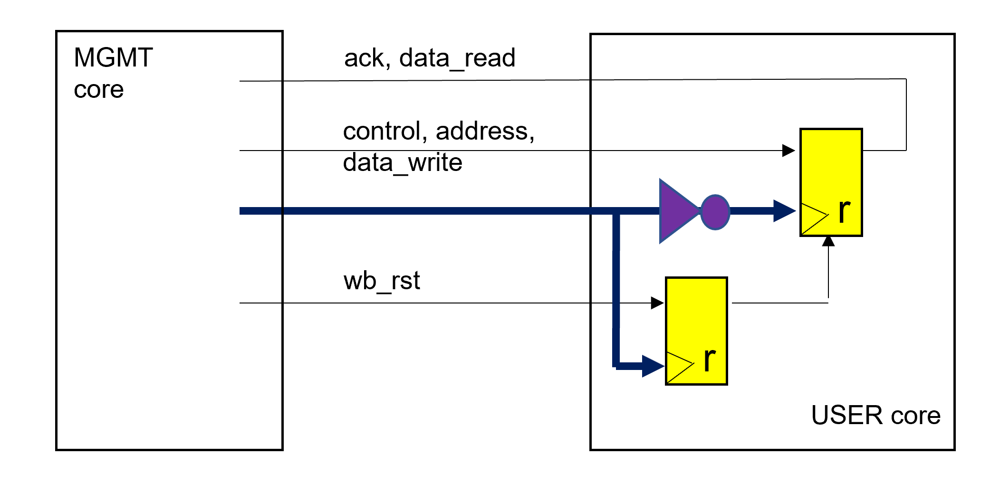

# Application Note WBHT: Fixing Caravel Wishbone and Logic Analyzer Interface Hold Time Issues

15th September 2022

Tobias Strauch, Munich, tobias at cloudx dot cc

## Introduction

The Caravel flow is unique in the sense, that a fixed macro (the management core) is used. The timing of the interface signals is relative to the Wishbone interface clock, which is an output of the macro. This creates a certain challenge to the Wishbone and logic analyzer interfaces. It requires the insertion of massive delay chains to reliably fix hold time violations in most of the projects. 

A simple standard method to solve the problem is proposed, which is based on the usage of inversely clocked registers. 

## Definitions
 

Figure 1: Common Wishbone and logic analyzer interface handling. Signal names are kept abstract for better readability. 

The following definitions are used:            

1) Insertion Delay (ID): Delay from clock root to a register clock input.
2) ID-M: Insertion delay inside the MGMT core. 
3) ID-O: Insertion delay, from clock root to MGMT core output
4) ID-U: Insertion delay inside the USER core (use_project_wrapper). 

The delays ID-M and ID-O are fixed. ID-U depends on the register load of the wb_clk_i clock domain. This delay can range from 0.2ns to 6 ns or even more.

## Problem

The wide ID-U variation can generate massive hold time violations. The overall delay values depend on the register load inside the USER core and on the resulting ID-M / (ID-O + ID-U) ratio, respectively. 
To overcome these hold time violations, delays (buffers or delay cells) must be inserted in the signal lines between the cores.
In the current Caravel flow release, these hold time constraints are not checked. 

It still might coincidently work in one or the other direction. But these constraints must be checked and violations must be fixed before tape-out.

## Proposal

The standard solution is to communicate with inversely clocked registers (here falling edge).
 

Figure 2: Using inversely clocked registers.

When using inversely clocked registers, a Wishbone related transaction is as follows:
1) The MGMT core outputs are valid at the rising edge of clk.
2) The USER core captures the signals at falling edge.
3) The User core sets its outputs valid based on the falling edge.
4) The MGMT core captures the incoming signals at the rising edge.

The hold time problem is solved. 

Interface logic must be adjusted accordingly.

Timing can be adjusted by the clock period and can be constraint by using standard maximal delay constraints considering the variable insertion delay.

The delays between the MGMT core registers and the USER core registers are usually small. Only in a hyper-theoretical case, larger multiplexer or demultiplexer structures could theoretically be timing critical, but then pipelining comes to the rescue.

It can be argued that the proposed solution always works.
 

Figure 3: Using inverter at the clock input of the USER core

It is reasonable, that the USER core can run with the inversible clock edge compared to the MGMT core. In this case, the relevant USER core registers can still be clocked with the rising edge, but an inverter must be inserted in the wb_clk_i clock tree to support the idea of inversely clocked registers at the interfaces (Figure 3).

Figure 4: Using falling edge registers to generate shift-based solution.

If this is not wanted, the falling edge registers can also be implemented as shift registers (Figure 4). Theoretically, they can be located inside future versions of the MGMT core as well.

Also latch based solutions are possible.
